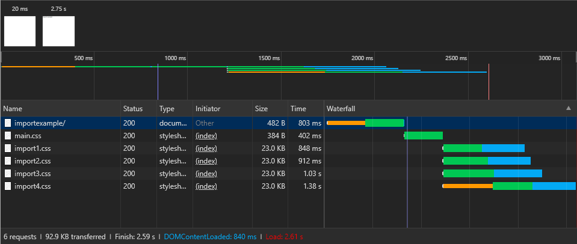

# CSS Performance

This repository is about how CSS makes your website faster or how CSS might slow down your website. Consider that CSS one of the biggest contributor to slow render times and if your website takes forever to load, chances are your users aren't gonna wait for it to finish loading.

## Table contents

- [CSS load time](#css-load-time)
- [CSS selectors](#css-selectors)
- [CSS Animations](#css-animations)
- [Contributors](#contributors)
- [Sources](#sources)


## CSS selectors
We humans read left to right but browsers read CSS selectors from right to left. It's more efficient for a browser to start at the right-most element (the one it knows it wants to style) and work its way back up the DOM tree than it is to start high up the DOM tree and take a journey down that might not even end up at the right-most selector–also known as the key selector.
For an in-depth reason as to why they browsers do this check this [discussion](https://stackoverflow.com/questions/5797014/why-do-browsers-match-css-selectors-from-right-to-left).

- Keep your CSS selectors short.
- Don't use star(*) selector as a child selector.
- Avoid expensive selectors and properties
    - :last-child
    - :first-child
    - :nth-child
    - :nth-type-of
    - border-radius
    - box-shadow
    - filter
    - transform
    - position fixed

> Roughly 50% of the time used to calculate the computed style for an element is used to match selectors...
[csswz.it/2GIs8l4](https://csswz.it/2GIs8l4)


## CSS load time
CSS is a render blocking resource. What to do about it?

Try reduce use of those rules because they require more time to be computed and rendered.

- Minify CSS

Minifying your CSS will drastically reduce the size that a user downloads to view your page.

- Don't use @import with CSS instead use &lt;link/&gt; in HTML

#### Example:
main.css just downloads fine but as soon as it opens this CSS file, main.css says go download those 4 files. We are creating long request chains and that increases render time by quite a lot. Web browsers can't start rendering until he gets all requested files from the start.



- Inline your CSS in HTML

Inlining CSS cuts down on the amount of data the browser needs to download before it can start rendering a page. When you use external CSS files, they must be downloaded separately after your markup document finishes downloading.

```html
<style>
.site-header {height: 55px; background-color: #fff;} ...
</style>
```


## CSS Animations
- Take care that your animations don’t cause performance issues; ensure that you know the impact of animating a given CSS property.
- Animating properties that change the geometry of the page (layout) or cause painting are particularly expensive.
- Where you can, stick to changing transforms and opacity.
- Use 'will-change' to ensure that the browser knows what you plan to animate.

### Using the will-change property:

Use the will-change to ensure the browser knows that you intend to change an element’s property. This allows the browser to put the most appropriate optimizations in place ahead of when you make the change. Don't overuse will-change, however, because doing so can cause the browser to waste resources, which in turn causes even more performance issues.

The general rule of thumb is that if the animation might be triggered in the next 200ms, either by a user’s interaction or because of your application’s state, then having will-change on animating elements is a good idea. For most cases, then, any element in your app’s current view that you intend to animate should have will-change enabled for whichever properties you plan to change. In the case of the box sample we’ve been using throughout the previous guides, adding will-change for transforms and opacity looks like this:

```css
.box {
  will-change: transform, opacity;
}
```

## Contributors
- [Stefanos Vichas](https://github.com/svichas/)

## Sources
- https://csswizardry.com/2011/09/writing-efficient-css-selectors/
- https://developer.mozilla.org/en-US/docs/Web/CSS/Descendant_selectors
- https://developers.google.com/web/fundamentals/performance/critical-rendering-path/render-blocking-css
- [Harry Roberts: FaCSSt—CSS and Performance](https://www.youtube.com/watch?v=2Rn8an74khk)
- [Animations and Performance](https://developers.google.com/web/fundamentals/design-and-ux/animations/animations-and-performance)
